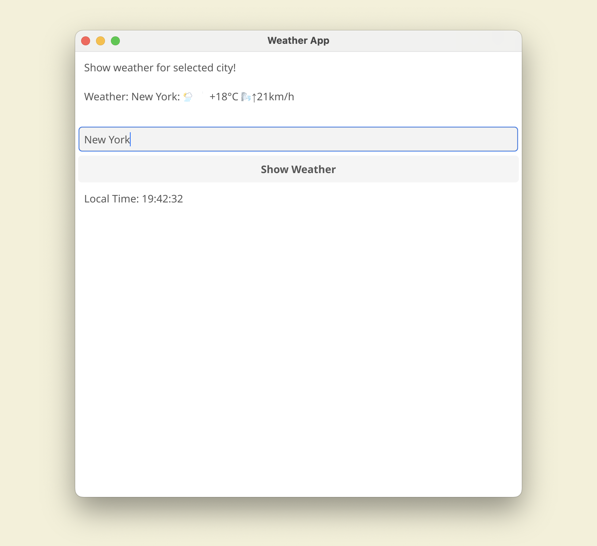

# Weather App

A simple desktop weather application built with Go and Fyne framework. The app shows current weather conditions for any city and displays local time.

## Features

- Real-time weather information using wttr.in API
- Local time display with automatic updates (updates every second)
- Weather auto-update (every hour)
- Simple and clean user interface
- Cross-platform support (Windows, macOS Intel/M1, Linux)

## Screenshots



## Prerequisites

- Go 1.24 or later
- Fyne dependencies (see [Fyne Getting Started](https://developer.fyne.io/started/))
- For Windows builds: MinGW-w64 GCC
- For development: golangci-lint, goimports

## Installation

1. Clone the repository:
```bash
git clone https://github.com/romanitalian/fyne-weather.git
cd fyne-weather
```

2. Install dependencies:
```bash
make deps
```

## Development Commands

Use `make help` to see all available commands. Here are the main ones:

### Running and Testing
```bash
make run    # or 'make r' - Run the application
make test   # or 'make t' - Run tests with coverage
make lint   # or 'make l' - Run linter (golangci-lint)
make format # or 'make f' - Format code using goimports
```

### Building

Build for your current platform:
```bash
make build
```

Platform-specific builds:
```bash
make build-windows     # Build for Windows
make build-macos-m1   # Build for macOS M1
make build-macos-intel # Build for macOS Intel
make build-linux      # Build for Linux
```

### Cleaning
```bash
make clean  # Clean build artifacts and cache
```

## Application Usage

1. Launch the application using `make run`
2. Enter a city name in the input field
3. Click "Show Weather" button to get current weather conditions
4. The application will:
   - Automatically update weather information every hour
   - Display and update local time every second

## Project Structure

```
.
├── main.go          # Main application code
├── build/           # Build artifacts (created during build)
├── Makefile         # Build and development commands
├── go.mod           # Go module definition
├── go.sum           # Go module checksums
├── example-1.png    # Example screenshot
└── README.md        # This file
```

## Contributing

1. Fork the repository
2. Create your feature branch
3. Make your changes
4. Run tests and linting:
   ```bash
   make test
   make lint
   ```
5. Format your code:
   ```bash
   make format
   ```
6. Create a pull request

## License

MIT License
